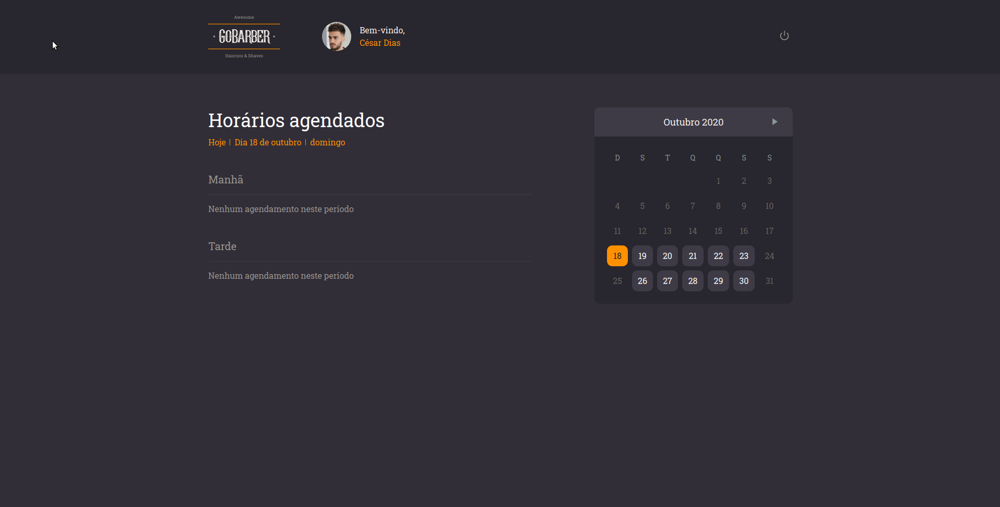

<h1 align="center">
<br>
    
    <br>
    <br>
    🚀 GoBarber Web
</h1>

<div align="center">
    &logo=<LOGO>"/>
    &logo=<LOGO>"/>
    &logo=<LOGO>"/>
    &logo=<LOGO>"/>
</div>


<h1> 📷 Projeto</h1>
<b>Na versão web da aplicação GoBarber, os prestadores de serviço poderão consultar sua agenda e editar seu perfil.</b>

<div align="center" id="id">
<br>
    

</div>
<br>

## 🚀 Tecnologias

Esse projeto foi desenvolvido utilizando as seguintes tecnologias:

- ✔ Typescript

- ✔ ReactJS

- ✔ React Hooks

- ✔ Context API

- ✔ Styled-Components

- ✔ React Spring

- ✔ Polished

- ✔ Axios

<br>

## ℹ Como usar

Para clonar e rodar essa aplicação, você precisará de ter instalado o <a href="https://git-scm.com/">Git</a>, <a href="https://nodejs.org/en/">NodeJS</a> e o <a href="https://yarnpkg.com/">Yarn</a> instalados em seu computador. Após as instalações rode os seguintes comandos no terminal:

```bash
# Clone o repositório
$ git clone https://github.com/SergioSantiag0/GoBarber-frontend/tree/043d7d3006e090279a9cef78741bf35587a3dd03

# Entre no repositório
$ cd GoBarber-frontend

# Instale as dependências
$ yarn install

# Rode a aplicação
$ yarn start
```

<h1> 📑 Licença</h1>
<b>Este projeto está sob a licença MIT. Veja a <a href="https://github.com/SergioSantiag0/GoBarber-FullStack/blob/master/LICENSE">LICENÇA</a> para mais informações</b>

<br>
<br>

<hr>

<p>Feito com ❤ por Sérgio Santiago 👏 <a href="https://www.linkedin.com/in/s%C3%A9rgio-santiago-16427217a/">Entre em contato!</a><p>
